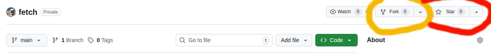

# How to contribute to this project

### 1. Fork this repository

Visit the [repository](https://github.com/amk-7/fetch.git) on github and fork it as shown below




### 2. Clone your new repository to your system.

### 3. Create a new branch named `feature/your-feature-name`.

### 4. Commit changes and push the new branch.

### 5. Create a pull request and submit it.

## Tests

Lancer la suite de tests :  
```bash
npm run test
```

### ps : This is the basic project structure

````	
src/
├── config.ts         # Configuration file
├── core              # Core functionalities
│   ├── action.ts     # Base action class
│   ├── cli.ts        # CLI Entrypoint
│   ├── jokes         # Joke module
│   │   ├── cli.ts
│   │   ├── data.json
│   │   ├── jokeAction.ts
│   │   ├── joke.ts
│   │   ├── options.ts
│   │   ├── tests
│   │   │   └── joke-action.test.ts
│   │   └── utils.ts
│   └── memes         # Memes module
│       ├── cli.ts
│       ├── default.json
│       ├── media
│       ├── memeAction.ts
│       ├── meme.ts
│       ├── options.ts
│       └── utils.ts
├── services        # Services
│   └── ai          # AI Services
│       ├── gemini.ts  # Gemini Services
│       ├── gtp.ts  # gpt Services
│       └── provider.ts  # Default Services
├── types          # Share type
│   └── index.ts
└── utils         #Utils
    ├── internet.utils.ts
    ├── logger.ts
    └── string.utils.ts

9 directories, 23 files
````